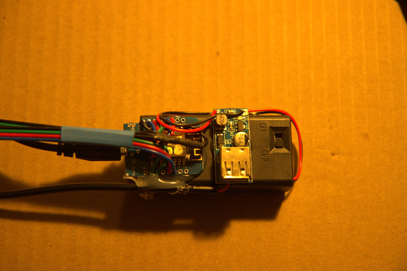
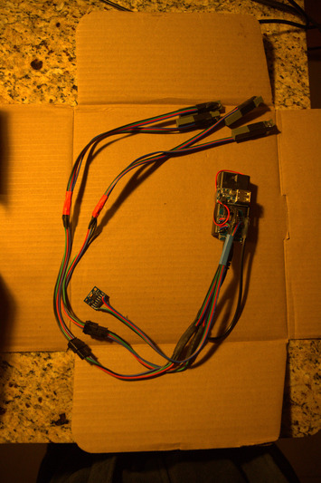

This repo documents an inexpensive reactive and dynamic target system, with a configurable and easy to use interface.

The d1 mini is ideally suited to this task
* cheap
* built in wifi (for target communications)
* enough i/o pins for 2 sets of leds
* enough i/o drive current for daylight bright leds without additional driver components

# Bill of materials (per target)
### power supply:
* 2xaa battery box - https://www.ebay.com/itm/274488658276
* ~~usb pigtail (to plug into d1 mini) - https://www.ebay.com/itm/193849305502~~ (I just directly solder the boost converter to the d1 mini now, bypassing this point of failure)
* boost converter (to convert to 5v) - https://www.ebay.com/itm/143853151565

### target:
* WeMos D1 Mini ESP8266 Arduino WiFi Board
* ADXL345 accelerometer - https://www.ebay.com/itm/114721937607
* common annode 4 color leds (clear seems brighter head on vs diffuse, common annode allows more current)- ~~https://www.ebay.com/itm/274488658276~~ I just search "5MM 4pin Common Anode Water Clear RGB" on ebay
* resistors (I chose 100 ohms for red, 220 ohms for green, and 50 ohms for blue)
* ~~connectors to make replacing broken leds easier (I used 4 pin jst sm connectors) - https://www.ebay.com/itm/274534656436~~ (I have stopped using these, I just hardwire all leds now. They haven't proven to be worth the hassle)
* extra wire, solder, heat shrink etc.. to connect everything together

### additional:
* wifi router ( i use GL.iNet GL-AR300M16-Ext https://www.amazon.com/dp/B07794JRC5)
* smartphone/computer to connect to targets and run game

# Build Instructions

### Wiring Diagram:

### Assembly:
You can arrange your components however you want. It was convenient for me to attach the d1 mini and the boost converter to the battery conatiner:

I left the leds and accelerometers a bit long 

I use these little led brackes to help secure the leds.
* led_bracket.stl in /stl 
* I manually drilled them out with a 1/8 drill for the leds to fit

Here you can see how they are attached to the target, with the accelerometer taped to the center, and the leds just slightly protruding

# Ide setup:

### Arduino/d1 mini setup: https://gist.github.com/carljdp/e6a3f5a11edea63c2c14312b534f4e53
* install latest arduino release https://www.arduino.cc/en/software/OldSoftwareReleases (or use ubuntu software repo)
* add board manager url: File -> preferences -> Additional Boards Manager URLs : http://arduino.esp8266.com/stable/package_esp8266com_index.json
* install d1 mini board: Tools -> Board:* -> Boards Manager... : install esp8266 (3.0.2 at time of writing)
* select d1 mini board: Tools -> Board:* -> ESP8266 Boards (3.0.2) -> LOLIN(WEMOS) D1 mini (clone)
* plug in d1 mini
* update port: Tools -> Port
* you can test this part of the setup by running the blink sketch, described in the above linked walkthrough

### adxl345 setup: https://www.teachmemicro.com/use-adxl345-arduino/
* from Tools -> Manage Libraries..., install “Adafruit ADXL345” (1.3.1 at time of writing), install all dependencies

### filesystem uploader: https://randomnerdtutorials.com/install-esp8266-filesystem-uploader-arduino-ide/
* unzip https://github.com/esp8266/arduino-esp8266fs-plugin/releases into tools folder
* for ubuntu repository arduino install, path was ~/snap/arduino/61/Arduino/tools/ESP8266FS/tool/esp8266fs.jar 
* for installing arduino outside of repository, path was ~/Arduino/arduino-1.8.15/tools/ESP8266FS/tool/esp8266fs.jar
* your path may be different, you can find the genral location from File -> Preferences : Sketchbook Location
You must restart arduino for the uploader to show up 
* uploader will be at Tools -> ESP8266 Sketch Data Upload

### Your IDE environment is now set up

# Send software to d1 mini:
* The project folder (git checkout dir) must be named d1_target
* In the Arduino IDE, Open d1_target.ino (the parent folder must also be named d1_target)
* Click Verify (Check mark below File)
* Click Upload (Right Arrow below Edit)
* Upload website data to d1 mini: Tools -> ESP8266 Sketch Data Upload (make sure any serial monitors are closed)

### d1 target software should now be on the d1 mini

# Wifi router setup
* the default ssid that the d1 mini targets will try to connect to is "TARGET_NET", and the password is "d1miniii"
  * you should set your router to those parameters, or update the parameters "ssid" and "wpass" in d1_target.ino (and then re upload) 
* targets are detected basically by a ping sweep, so limiting the dhcp address range helps if possible
* having a portable router that can run off a usb battery pack helps if you are moving your targets outside of the house

# Testing

### Obtain IP Address:
* when the target is able to connect to wifi, and get an ip address, all 4 leds will turn green (and stay green until given another command)
* you need to obtain the ip address of your d1 mini. this can be done in several ways:
  * you can use the arduino serial monitor (Tools -> Serial Monitor, use 115200 baud) then plug the target into your usb cable.  after the target boots up and gets an ip connection, it will output the ip address
  * use your wifi router interface to find the ip address from a client list
  * manually start testing ip addresses starting at your router's dhcp address range

### Run a blink command:
* `curl 'http://<ip address>/blink?count=3&on=500&off=500&color=r'`
  * All 4 leds should blink red 3 times
* `curl 'http://<ip address>/blink?count=3&on=500&off=500&color=g'`
  * All 4 leds should blink green 3 times
* `curl 'http://<ip address>/blink?count=3&on=500&off=500&color=b'`
  * All 4 leds should blink blue 3 times
* `curl 'http://<ip address>/blink?count=3&on=500&off=500&color=w'`
  * All 4 leds should blink white 3 times
* curl command should return `{"blinked":true}`

### Run a target command
* `curl 'http://<ip address>/target?x=20&y=20&z=20&duration=10000'`
  * All 4 leds should turn blue for 10 seconds (duration value=milliseconds) then turn red
  * your curl command should return something like this:
`{"x":0,"y":0,"z":0,"hit_time":0.00,"hit_interval":0,"max_interval":1552,"sample_interval":1250,"samples":8002,"expected_samples":8001}`
  * x, y, and z are the maximum g force (in 10ths of a g) that was experienced by the accelerometer during the target command

### Interact with target: 
* `curl 'http://<ip address>/target?x=20&y=20&z=20&duration=10000'`
  * All 4 leds should turn blue. Flick the accelerometer within 10 seconds (duration = milliseconds), All leds should turn green
  * Your curl command should return something like this:
`{"x":10,"y":9,"z":73,"hit_time":874.00,"hit_interval":1249,"max_interval":1531,"sample_interval":1250,"samples":701,"expected_samples":700}`
  * x, y, and z should be nonzero, and scale relative to how hard the accelerometer was flicked

### Load Web UI

### If all of these work, you can safely assume that this target is tested working

# Gameplay:

### Load the game interface in a web browser
* You will need to open a web browser on your smartphone, laptop, etc.. that is connected to the same network as the target.
* go to one of the addresses of your targets.  Each target will have the web page code, so you only need to find one of them.
  * I personally just manually type in the first address of the dhcp range I have set up in my router, then manually increment until I hit one.
  * You can also find the ip of one of the targets by connecting it to the serial arduino monitor

## There are 3 sections of the ui:

### Target Setup
The first section of the UI detects the targets.

* Expected Targets: This represents how many targets you expect to be detected (how many are currently on, with green lights indicating they have an ip address)
* Subnet Prefix/Subnet Start/Subnet End: this defines the range to be scanned for targets
  * In this case we will scan 192.168.8.230 - 192.168.8.854
  * This should generally correspond with the dhcp address range you have configured on your wifi router
* Target Timeout: How long to wait for each target to respond
* Concurrent Detection:  How many targets should be pinged at a time
* Manually Add IP: If you want to manually type in ip addresses
* Detect Targets: Scan the ip address range above using the timeouts, and add targets as they respond
* Clear Targets: Clear any targets that have been found

Once target detection or manual addition is complete, you should see the targets listed

* Each ip address is a clickable button that will cause the corresponding target to light up blue for 3 seconds, then return the maximum g force the target experienced while light.

### Stage Setup
Your gameplay consists of multiple actions linked together to form a stage. You can use the plus and minus buttons to add or remove actions.

Action: Blink - This action will blink all targets, at the same time, with the specified parameters.
* Count: The number of times each target should blink
* Color: The color of the leds that should be set during the blinks
* On Time (ms): The amount of time each led should stay on per blink, in milliseconds
* Off Time (ms): The amount of time each led should stay off per blink, in milliseconds

Action: Delay - This action will insert a delay between other actions equal to (Time + (between 0 and Random Time)) milliseconds.
* Time (ms): The amount of time that this action will delay
* Random Time (ms): An additional maximum random delay added to the fixed above delay (random value between 0 and this value)

Action: Target - this causes targets to be available to be hit
* Count: The total number of targets that will be available to be hit during this action
* Reuse: If a target can be light more than once during this action
  * targets are picked randomly, if reuse is enabled, then a target, once light, will go back into the random selection pool
  * if not enabled, only min(count, existant targets) can be light, because the random target selector will not consider a target again after it has been light
* Delay (ms): The delay between each target being light and available to be hit.
* Random Delay (ms): An additional maximum random delay (random value between 0 and this value)
* Concurrent: How many targets to light concurrently
* Link Concurrent: Should all concurrent targets have to be hit before new targets can be light
* On Time (ms): Amount of time the target will be light before either being hit, or considered a failure
* G Trigger (tenths): How hard you need to hit the target to register (140 = 14.0 g)
* Miss Penalty (ms): How much time should be added to your score should you fail to hit the target in the alloted time 

Here is our sample game:
* We blink white 3 times, to indicate to the player that the stage is beginning
* Each of our 6 targets will be light once, in a random ordering
  *The Player gets 3 seconds to hit the target before it is considered a failure

The target UI works as such:
* A target lights up blue, indicating that it is available to be hit
* If the target is hit before the time limit expires, the target turns green, and another target is light (if any more are available)
* If the target expires before being hit, the target turns red, and another target is light (if any more are available)

## Game Results
Game results are broken down into sections. 
* The first section is the overall summed results of all target actions
* Subsequent sections give the results of each action individually

### Target Actions Summary
* Misses: The total misses of all target actions
* Penalty: The total penalties accrued over all target actions 
* Overall: The total time to complete all actions
* Target Stage Time: The total time to complete all target actions
* Target Time: The total time that each target was blue, before being hit or timing out (as measured on the target)
  * In my opinion this is the most fair and valuable score, as it is not effected by any network latency
* Hit Variance: This is mostly a debug parameter.  It indicates the maximum time error during the iteration on the d1 mini during which the hit was detected
* Sample Variance: This is mostly a debug parameter.  It indicates the sumation of all time error on sampling intervals for the d1 min.
  * Time error exists in this project as the d1 mini requires the programmer to yeild time to it to handle the tcp/ip stack, and this time is non deterministic. 

### Individual Actions 
* For blink and delay actions, these just display the time information that each action consumed
* For target actions, the metrics are similar to the summary above, with the addition of timing information for each individual target.

# Design notes
The d1 mini i/o pins are documented to provide 12ma max, however it supposedly can provide up to 15ma if you use the i/o pins to provide grounds to the leds, which is why I use common annode leds 

Here is the led characterization i got for various resistor configurations using the d1 mini i/o output voltage (for ~~https://www.ebay.com/itm/274488658276~~ search "5MM 4pin Common Anode Water Clear RGB" on ebay)
I tested both single leds, and 2 leds in parallel (which is the configration used in this project

|Leds in parallel|resistor ohms|Red ma|Green ma|Blue ma|
|---|---|---|---|---|
|1|50|13|7|6|
|1|100|23|11|10|
|1|220|7|4|4|
|2|50|26|14|12|
|2|100|14|9|7|
|2|220|7|5|4|

For 2 leds in parallel, the following resistor values provided the maximum output, while staying under the maximum 15ma current, and appearing of similar brightness
* red: 100 ohms
* green: 220 ohms
* blue: 50 ohms
